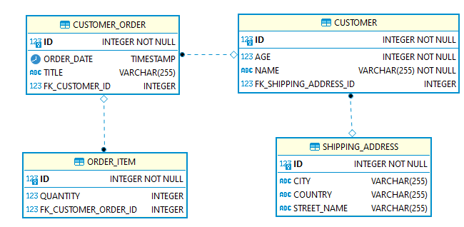

# Spring Boot Hibernate Bidirectional Many-to-One Relationship Mapping

[](https://openjdk.java.net/)
[](https://spring.io/projects/spring-boot)
[](https://maven.apache.org/)
[](LICENSE)

A comprehensive Spring Boot application demonstrating Hibernate bidirectional many-to-one relationship mapping with a complete customer order management system.

## 📋 Table of Contents

- [Features](#features)
- [Architecture](#architecture)
- [Tech Stack](#tech-stack)
- [Prerequisites](#prerequisites)
- [Installation](#installation)
- [Usage](#usage)
- [Configuration](#configuration)
- [Caching](#caching)
- [API Documentation](#api-documentation)
- [Testing](#testing)
- [Project Structure](#project-structure)
- [Contributing](#contributing)
- [License](#license)

## ✨ Features

- **Bidirectional Relationship Mapping**: Demonstrates Hibernate many-to-one relationships between Customer, CustomerOrder, OrderItem, and ShippingAddress entities
- **RESTful API**: Complete CRUD operations for all entities
- **Swagger UI**: Interactive API documentation
- **H2 Database**: In-memory database with console access
- **Resilience4j**: Circuit breaker, retry, time limiter, and bulkhead patterns for service reliability
- **Global Error Handling**: Centralized exception handling with standardized HTTP error responses
- **Validation**: Jakarta Bean Validation for request payloads and domain constraints
- **Spring Boot Actuator**: Health checks, metrics, info, and Prometheus-compatible metrics export
- **Comprehensive Testing**: Unit tests, integration tests, and Layer 2 smoke tests
- **Containerized Testing**: Docker-based smoke tests for production-like validation
- **Idempotent order creation**: Optional `Idempotency-Key` header on `POST /customerorder/save` stores a mapping in `idempotency_record` so retries return the same saved order instead of creating duplicates
- **Response caching**: Spring Cache with Caffeine on read paths in the service layer (`@Cacheable` / `@CacheEvict`), with cache-friendly JPA fetch queries for customer orders and shipping-address lookups

## 🏗️ Architecture

### Entity Relationships

```
Customer (1) ────→ (Many) CustomerOrder
Customer (1) ────→ (1) ShippingAddress
CustomerOrder (1) ────→ (Many) OrderItem
```

**Key Points:**
- Many OrderItems are related to one parent CustomerOrder entity
- Bidirectional navigation between entities
- Cascade operations for data persistence
- Lazy/Eager loading configurations

### Idempotency (customer orders)

Create-order requests may send an optional HTTP header `Idempotency-Key` (non-blank string, up to 128 characters in storage). The first successful save persists the new order id keyed by `(idempotency_key, entity_type)` in the `idempotency_record` table. Later requests with the same key for customer orders load that order from the database and return it with no second insert. If the header is omitted or blank, behavior is unchanged from a normal create.

### ER Diagram



## 🛠️ Tech Stack

- **Java**: 25
- **Spring Boot**: 4.0.6
- **Spring Data JPA**: Hibernate implementation
- **Resilience4j**: Circuit breaker, retry, time limiter, and bulkhead support
- **Jakarta Bean Validation**: Request payload validation via Spring Boot starter validation
- **Database**: H2 (In-memory)
- **Build Tool**: Maven 3.9.11
- **Documentation**: SpringDoc OpenAPI (Swagger)
- **Testing**: JUnit 5, Spring Boot Test
- **Monitoring**: Spring Boot Actuator (health, metrics, info) and Micrometer Prometheus registry
- **Logging**: Logback
- **SQL observability**: datasource-proxy (JDBC proxy for SQL logging and diagnostics)
- **Caching**: Spring Cache abstraction backed by **Caffeine** (`spring-boot-starter-cache` + `caffeine`)
- **Containerization**: Docker & Docker Compose

## 📋 Prerequisites

- **Java**: JDK 25 or higher
- **Maven**: 3.9.11 or higher
- **Docker**: For running smoke tests (optional)
- **Git**: For version control

## 🚀 Installation

1. **Clone the repository**
   ```bash
   git clone https://github.com/tufangorel/spring-boot-hibernate-bidirectional-many-to-one-relationship-mapping.git
   cd spring-boot-hibernate-bidirectional-many-to-one-relationship-mapping
   ```

2. **Build the application**
   ```bash
   ./mvnw clean compile
   ```

3. **Run the application**
   ```bash
   ./mvnw spring-boot:run "-Dspring-boot.run.profiles=dev"
   ```

The application will start on `http://localhost:8080/customer-info`

## 📖 Usage

### Application Profiles

- **dev**: Development profile with detailed logging; **Spring Cache is disabled** (`spring.cache.type=none`) so integration tests stay deterministic
- **test**: Testing profile with test-specific configurations
- **default** (no profile, or non-dev): Caffeine cache settings from `application.yml` apply

### Accessing the Application

- **Swagger UI**: http://localhost:8080/customer-info/swagger-ui/index.html
- **H2 Console**: http://localhost:8080/customer-info/h2/
- **Health Check**: http://localhost:8080/customer-info/actuator/health
- **Prometheus scrape**: http://localhost:8080/customer-info/actuator/prometheus

## ⚙️ Configuration

The application uses `src/main/resources/application.yml` to configure the servlet context path, H2 datasource, JPA settings, logging, actuator endpoints, Resilience4j policies, and Caffeine-backed Spring Cache. The default context path is `/customer-info`.

The `resilience4j` configuration includes:
- `circuitbreaker` for failure isolation
- `retry` for transient error retries
- `timelimiter` for request timeouts
- `bulkhead` for concurrent call limits

Actuator web endpoints exposed by default in `application.yml` include `health`, `metrics`, `prometheus`, and `info`.

### H2 Database Configuration

- **URL**: `jdbc:h2:mem:cust`
- **Username**: `sa`
- **Password**: `123456`
- **Driver**: `org.h2.Driver`

## Caching

Caching is applied in **services** (not controllers): `@Cacheable` on read methods and `@CacheEvict` (including `@Caching`) after writes so lists and detail views stay consistent.

| Cache name | Backed data | Typical invalidation |
|------------|-------------|----------------------|
| `customers` | `CustomerService.findAll`, `findCustomerById` | Customer save/delete (and idempotent customer save) |
| `customerOrders` | `CustomerOrderService.findAll`, `findById` | Customer order save/delete; order item save/delete |
| `orderItems` | `OrderItemService.findAll`, `findById` | Order item save/delete; customer order save/delete |
| `customerByShippingAddress` | `ShippingAddressService.findCustomerByShippingAddressID` | Customer save/delete |

**Defaults** (`application.yml`): `spring.cache.type=caffeine`, up to **1000 entries** per cache, **10 minutes** time-to-live after write (`expireAfterWrite`). Cache names are declared explicitly under `spring.cache.cache-names`.

**JPA and JSON**: Customer orders are loaded with **join-fetch** repository methods (`findAllWithAssociations`, `findByIdWithAssociations`) so cached `CustomerOrder` graphs include `orderItems`, `customer`, and `shippingAddress` where needed. The shipping-address lookup uses a `Customer`-root fetch query so Hibernate 6 join rules are satisfied.

**Profiles**: The **`dev`** profile sets `spring.cache.type=none` in `application-dev.properties` (integration tests use `@ActiveProfiles("dev")`). **Test** `application*.properties` also set `spring.cache.type=none` so Surefire runs do not depend on cache state. Run **without** the `dev` profile (default `application.yml`) to exercise in-memory caching locally.

## 📚 API Documentation

### Customer Management

#### Create Customer
```bash
POST /customer-info/customer/save
Content-Type: application/json

{
    "name": "John Doe",
    "age": 30,
    "shippingAddress": {
        "streetName": "123 Main St",
        "city": "Istanbul",
        "country": "TR"
    }
}
```

#### List Customers
```bash
GET /customer-info/customer/list
```

#### Update Customer
```bash
PUT /customer-info/customer/update/{id}
```

#### Delete Customer
```bash
DELETE /customer-info/customer/delete/{id}
```

### Order Management

#### Create Customer Order with Items

Optional header for safe retries (same body + same key returns the first persisted order):

```http
Idempotency-Key: 550e8400-e29b-41d4-a716-446655440000
```

```bash
POST /customer-info/customerorder/save
Content-Type: application/json

{
  "customer": {
    "id": 1,
    "name": "John Doe",
    "age": 30,
    "shippingAddress": {
      "id": 1,
      "streetName": "123 Main St",
      "city": "Istanbul",
      "country": "TR"
    }
  },
  "orderDate": "2026-04-28T16:00:00",
  "title": "Spring Order",
  "orderItems": [
    {
      "quantity": 2
    },
    {
      "quantity": 1
    }
  ]
}
```

#### List Customer Orders
```bash
GET /customer-info/customerorder/list
```

#### Update Customer Order
```bash
PUT /customer-info/customerorder/update/{id}
```

#### Delete Customer Order
```bash
DELETE /customer-info/customerorder/delete/{id}
```

### Order Item Management

#### List Order Items
```bash
GET /customer-info/orderitem/list
```

#### Create Order Item
```bash
POST /customer-info/orderitem/save
Content-Type: application/json

{
    "quantity": 5
}
```

#### Update Order Item
```bash
PUT /customer-info/orderitem/update/{id}
```

#### Delete Order Item
```bash
DELETE /customer-info/orderitem/delete/{id}
```

## 🧪 Testing

### Unit Tests & Integration Tests

Run all tests:
```bash
./mvnw test
```

Run only integration tests:
```bash
./mvnw test -Dtest="*IntegrationTest"
```

Integration tests include, among others, `CustomerOrderIdempotencyIntegrationTest` (verifies duplicate `POST` with the same `Idempotency-Key`), `CustomerOrderServiceIntegrationTest`, `CustomerServiceIntegrationTest`, and `DatasourceProxyListenerIntegrationTest`.

Caching is turned off under the `dev` profile and in shared test `application*.properties` (`spring.cache.type=none`), so these tests always hit the database unless you change that configuration.

Run with coverage:
```bash
./mvnw test jacoco:report
```

### Layer 2 Smoke Tests

The project includes comprehensive Layer 2 smoke tests that validate the application in a containerized environment.

#### Prerequisites for Smoke Tests
- Docker installed and running
- Docker Compose available

#### Running Smoke Tests

**Unix/Linux/Mac:**
```bash
bash .github/integration-tests/run-layer2-tests.sh
```

**Windows:**
```powershell
powershell -NoProfile -ExecutionPolicy Bypass -File .github/integration-tests/run-layer2-tests.ps1
```

#### What Smoke Tests Validate
- ✅ Application startup and health endpoint
- ✅ Customer creation and persistence
- ✅ Customer order creation with multiple items
- ✅ Bidirectional relationship integrity
- ✅ Database operations in containerized environment

### Test Results
```
✅ Layer 2 smoke tests PASSED
========================================
```

## 📁 Project Structure

```
spring-boot-hibernate-bidirectional-many-to-one-relationship-mapping/
├── .github/
│   └── integration-tests/          # Layer 2 smoke tests
├── src/
│   ├── main/
│   │   ├── java/
│   │   │   └── com/company/customerinfo/
│   │   │       ├── config/         # Configuration classes
│   │   │       ├── controller/     # REST controllers
│   │   │       ├── model/          # JPA entities (including IdempotencyRecord)
│   │   │       ├── repository/     # Data repositories (including IdempotencyRecordRepository)
│   │   │       ├── service/        # Business logic, Resilience4j, @Cacheable / @CacheEvict
│   │   │       └── CustomerInfoApplication.java
│   │   └── resources/              # Application properties
│   └── test/                       # Unit and integration tests
├── doc/                            # Documentation and diagrams
├── pom.xml                         # Maven configuration
├── mvnw & mvnw.cmd                 # Maven wrapper
└── README.md                       # This file
```

## 🤝 Contributing

1. Fork the repository
2. Create a feature branch (`git checkout -b feature/amazing-feature`)
3. Commit your changes (`git commit -m 'Add amazing feature'`)
4. Push to the branch (`git push origin feature/amazing-feature`)
5. Open a Pull Request

### Development Guidelines

- Follow Spring Boot best practices
- Write comprehensive unit tests
- Update documentation for API changes
- Ensure all tests pass before submitting PR
- Use meaningful commit messages

## 📄 License

This project is licensed under the MIT License - see the [LICENSE](LICENSE) file for details.

## 🙋 Support

If you have any questions or issues:

1. Check the [Issues](https://github.com/tufangorel/spring-boot-hibernate-bidirectional-many-to-one-relationship-mapping/issues) page
2. Review the API documentation in Swagger UI
3. Check the Layer 2 smoke test results for common issues

---

**Happy Coding! 🚀**
