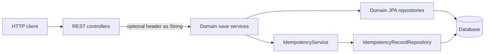
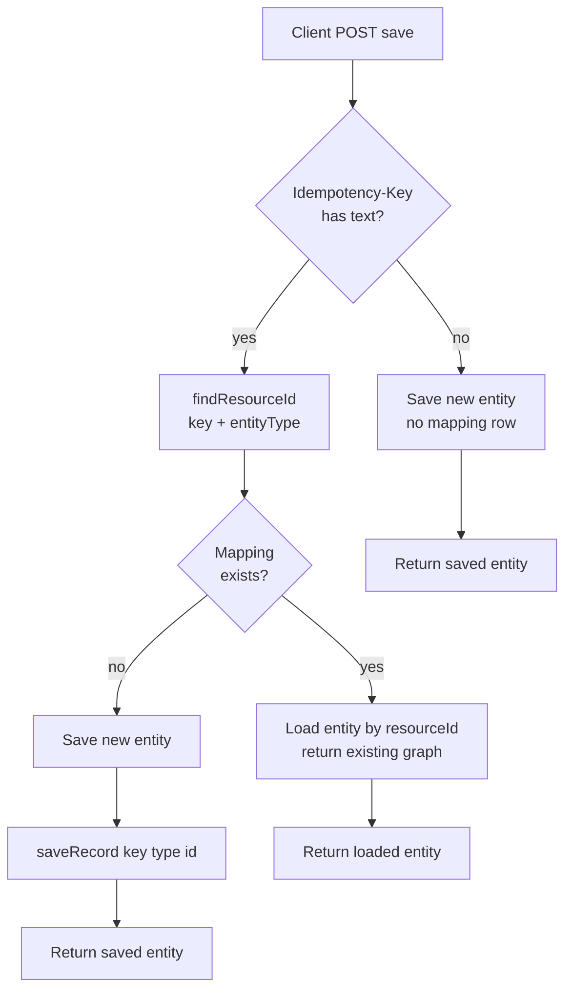

# Idempotent create operations

This document describes how **optional `Idempotency-Key`** support works for selected **POST save** endpoints: goals, **why idempotency is implemented and its advantages**, **architectural design**, HTTP contract, persistence model, runtime behavior, interaction with caching and resilience, tests, and limitations.

> Implementation: `IdempotencyService`, `IdempotencyRecord` / `IdempotencyRecordRepository`, and the `save(..., String idempotencyKey)` overloads on **`CustomerService`**, **`CustomerOrderService`**, and **`OrderItemService`**. Controllers pass through the **`Idempotency-Key`** request header when present.

For a short overview in the main readme, see the project [`README.md`](../README.md) (Features, Architecture, and Order Management sections).

---

## 1. Goals

- **Safe retries:** Clients (or gateways) that retry the same logical create after a timeout or ambiguous response can send the same key so the server returns the **already persisted** resource instead of inserting again.
- **Explicit opt-in:** The header is **optional**. If it is omitted or blank, saves behave like a normal create.
- **Stable keying:** Each logical create is keyed by **`(idempotency_key, entity_type)`** in the database so the same string can be reused for different resource kinds without collision.

---

## 2. Why implement idempotency, and advantages

### 2.1 Problems this addresses

**POST** creates are not naturally safe to repeat. In real deployments the same logical “create once” request can arrive more than once because of:

- **Transient failures and retries** — the client, API gateway, or service mesh retries after a timeout or **HTTP 5xx** / connection reset, sometimes without knowing whether the server committed the first attempt.
- **Duplicate delivery** — at-least-once messaging, mobile clients double-submitting, or orchestration engines replaying a step.
- **Ambiguous outcomes** — the caller receives no response or a non-parseable error while the server actually persisted the row.

Without server-side idempotency, those patterns tend to create **duplicate rows** (multiple orders, customers, or line items for one user intent), which complicates **support**, **reconciliation**, and **downstream workflows** (billing, fulfillment, analytics).

### 2.2 Advantages this design provides

| Advantage | What you get |
|-----------|----------------|
| **Safer retries** | A client that replays the **same** payload with the **same** **`Idempotency-Key`** receives the **already stored** resource instead of a second insert, once the first create has succeeded and the mapping row exists. |
| **Clearer data integrity** | Fewer accidental duplicates from benign retry behavior; one key + one entity type maps to **one** persisted resource id in **`idempotency_record`**. |
| **Simpler client logic** | Callers can adopt a straightforward rule: “on uncertain failure, retry with the same key” instead of custom deduplication against list APIs. |
| **Explicit opt-in** | Omitting or blanking the header preserves **legacy** “always insert” behavior; idempotency does not change existing clients that do not send a key. |
| **Composable with other features** | The check runs **inside** domain **`save`** methods, so it coexists with **rate limiting**, **caching**, **resilience** policies, and **validation** already applied to those methods (see later sections and [`doc/rate-limiting.md`](rate-limiting.md)). |
| **Observable mapping** | The **`idempotency_record`** table gives operators a simple **intent → resource id** audit trail for supported creates (subject to your retention policy). |

### 2.3 What this sample implementation is (and is not)

**It is** a practical pattern for **single-instance** Spring services and **teaching**: optional header, small shared **`IdempotencyService`**, and a dedicated mapping table.

**It is not** a full payment-processor-grade idempotency framework: there is **no** request-body fingerprinting, **no** built-in TTL or key rotation policy in the default app, and **concurrent** “first” creates with the same key are only **partially** guarded (see **§5.3** persistence notes). Tighten with distributed locks, stronger uniqueness on business keys, or external idempotency stores if your domain requires that bar.

---

## 3. HTTP contract

### 3.1 Header

| Header | Required | Semantics |
|--------|----------|-----------|
| **`Idempotency-Key`** | No | Omitted, blank, or whitespace-only → idempotency is **skipped** (normal insert). Non-blank → participates in lookup and, after success, record insert. |

Storage maps the key to an integer resource id. The JPA column **`idempotency_key`** is **`VARCHAR(128)`** — keep keys within that length in practice.

### 3.2 Endpoints that honor the header

All are under the application context path **`/customer-info`** (see `spring.servlet.context-path`).

| Method and path | Service entity type (internal) |
|-----------------|--------------------------------|
| **`POST /customer-info/customer/save`** | `customer` |
| **`POST /customer-info/customerorder/save`** | `customerOrder` |
| **`POST /customer-info/orderitem/save`** | `orderItem` |

Controllers declare the header as optional, for example:

`@RequestHeader(value = "Idempotency-Key", required = false) String idempotencyKey`

---

## 4. Architectural design

This section describes **where** idempotency lives in the application, **how** components interact, and **why** the structure looks the way it does.

### 4.1 Layering and responsibilities

| Layer | Role |
|-------|------|
| **REST controllers** (`CustomerController`, `CustomerOrderController`, `OrderItemController`) | Transport only: read optional **`Idempotency-Key`** and pass it as a **`String`** into the service **`save(..., idempotencyKey)`** overload. No lookup or mapping logic. |
| **Domain services** (`CustomerService`, `CustomerOrderService`, `OrderItemService`) | Orchestrate **normal create** vs **replay**: call **`IdempotencyService.findResourceId`**, branch to **load-by-id** or **insert**, then **`IdempotencyService.saveRecord`** after a successful insert. Own validation, associations, caching annotations, and resilience annotations. |
| **`IdempotencyService`** | Small shared façade: **read** mapping (`findResourceId`, read-only transaction) and **write** mapping (`saveRecord`, skip blank keys, tolerate duplicate key on insert). No knowledge of JSON or HTTP beyond the key string. |
| **`IdempotencyRecord` + repository** | Persistence for the **mapping table** only; **unique** on **`(idempotency_key, entity_type)`** enforces one row per logical key per resource family. |

Domain **entities** (customer, order, item) do **not** carry the client idempotency key; the mapping is **orthogonal** storage. That keeps the model normalized and lets one service pattern serve three aggregates.

### 4.2 Request path (structural view)

> **GitHub:** Same Mermaid conventions as elsewhere in this doc (` `, quoted labels).

### 4.3 Transaction boundaries

- **`IdempotencyService.findResourceId`** is annotated **`@Transactional(readOnly = true)`** for a consistent read of the mapping row.
- **`IdempotencyService.saveRecord`** is **`@Transactional`** and runs **after** the domain **`save`** inside the outer service method’s transaction (for example **`CustomerOrderService.save`** is **`@Transactional`**), so the new **domain row** and the new **mapping row** typically commit **together** on success.
- On **replay**, the service returns a **loaded** entity (often via a fetch-join query for orders) **without** inserting again; **`saveRecord`** is not called on that path.

### 4.4 Cross-cutting concerns (ordering relative to other features)

Idempotency checks run **inside** the domain service method body, **after** any upstream advice that applies to that method—for example **rate limiting** runs first at **`Ordered.HIGHEST_PRECEDENCE`**, then the transactional **save** (including idempotency lookup and insert) runs inside the advised call. See [`doc/rate-limiting.md`](rate-limiting.md) for filter and aspect ordering.

**Caching:** **`@CacheEvict` / `@Caching`** on save methods still run for both **first insert** and **idempotent replay** return paths where the service implementation evicts caches, so list/detail views do not serve stale data.

**Resilience4j:** Circuit breaker / retry wrap the **whole** `save` method. A replay that only reads mapped data still flows through the same annotations as a first-time create (behavior depends on failure vs success on prior attempts).

### 4.5 Design trade-offs (explicit)

| Choice | Benefit | Cost / caveat |
|--------|---------|----------------|
| **Mapping table** instead of a column on each entity | One schema and **`IdempotencyService`** for all supported creates; easy to extend with new **`entity_type`** values. | Extra table and join key discipline; operational cleanup of old rows is your responsibility. |
| **Service-layer enforcement** | Works for any caller of **`save(..., key)`** (REST today, jobs or tests tomorrow) with the same semantics. | Callers must pass the key through; forgetting the parameter bypasses idempotency. |
| **Replay = load by stored id** | Strong “same resource” guarantee for retries of the **same** key once the mapping exists. | If the underlying row is deleted, the key hits **missing resource** behavior (`IllegalStateException`), not silent recreate. |
| **No distributed lock on first create** | Simple implementation suitable for teaching and single-instance deployments. | Two concurrent **first** requests with the same key can still create **two** domain rows; only the mapping insert is protected by uniqueness (see **§5.3**). |

---

## 5. Persistence model

### 5.1 Table `idempotency_record`

| Column | Role |
|--------|------|
| **`id`** | Surrogate primary key (`IDENTITY`). |
| **`idempotency_key`** | Client-supplied key (max **128** characters in schema). |
| **`entity_type`** | Discriminator for which resource family the key maps to (`customer`, `customerOrder`, `orderItem`). |
| **`resource_id`** | Integer id of the persisted row (customer id, customer order id, or order item id). |

**Unique constraint:** **`(idempotency_key, entity_type)`** — one mapping row per key per entity type.

### 5.2 When the row is written

After a **successful** `repository.save(...)` of the new entity, the service calls **`IdempotencyService.saveRecord(idempotencyKey, entityType, resourceId)`**. If the key is null or blank, **`saveRecord`** returns immediately and writes nothing.

### 5.3 Duplicate record insert (concurrency)

If two threads attempt **`saveRecord`** for the same key and type, the second can hit **`DataIntegrityViolationException`**; **`IdempotencyService`** catches it, logs a **WARN**, and does not fail the request (the first writer’s mapping wins). This protects the mapping table; it does **not** by itself prevent two concurrent **first** creates from both inserting entities if both pass the initial lookup before either mapping exists. Design for **retries after at least one success has committed** the mapping.

---

## 6. Runtime behavior (per save)

> **GitHub:** Mermaid uses ` ` for line breaks and quoted labels where needed so the diagram renders in GitHub’s rich Markdown view.

If a mapping exists but the referenced row was deleted or is missing, services throw **`IllegalStateException`** with a message that the idempotency key exists but the resource is missing (fail fast instead of silently re-inserting).

---

## 7. Interaction with caching and resilience

- **Caching:** Write paths use **`@CacheEvict`** (and **`@Caching`**) on saves so list/detail caches stay coherent when a new row is inserted or when a replay returns an existing entity. The readme cache table notes invalidation for **idempotent customer save** and related caches (`customers`, `customerOrders`, `orderItems`).
- **Resilience4j:** Saves remain wrapped with **`@CircuitBreaker`**, **`@Retry`**, etc., on the service methods. Idempotency runs **inside** the same method body as the persistence logic (after rate limiting, per your aspect ordering — see [`doc/rate-limiting.md`](rate-limiting.md)).

---

## 8. Payload notes (customer orders)

Idempotency keys **do not** change validation or association rules:

- Nested **`customer.id`** / **`shippingAddress.id`** must refer to **existing** rows when you send full graphs, or use the **minimal** `customer: { "id": N }` shape for an existing customer (see README Order Management). There is **no** `CascadeType.PERSIST` on **`CustomerOrder.customer`**, so you cannot create a brand-new customer from that minimal JSON alone.

The integration test **`CustomerOrderIdempotencyIntegrationTest`** uses the minimal customer reference style together with a fixed **`Idempotency-Key`**.

---

## 9. Testing

| Test | Role |
|------|------|
| **`CustomerOrderIdempotencyIntegrationTest`** | Issues duplicate **`POST /customerorder/save`** with the same **`Idempotency-Key`** and asserts a single persisted order (no duplicate insert for the replay). |

There is no separate `*Idempotency*` integration class for **customer** or **order item** saves in this repository; behavior follows the same **`IdempotencyService`** pattern as **`CustomerOrderService`**.

---

## 10. Code map

| Piece | Responsibility |
|-------|----------------|
| **`IdempotencyRecord`** | JPA entity for table **`idempotency_record`**. |
| **`IdempotencyRecordRepository`** | **`findByIdempotencyKeyAndEntityType`**. |
| **`IdempotencyService`** | **`findResourceId`**, **`saveRecord`** (skips blank keys; swallows duplicate mapping insert). |
| **`CustomerService.save`**, **`CustomerOrderService.save`**, **`OrderItemService.save`** | Lookup → short-circuit return loaded entity, or insert then **`saveRecord`**. |
| **`CustomerController`**, **`CustomerOrderController`**, **`OrderItemController`** | Pass **`Idempotency-Key`** into **`save(..., idempotencyKey)`**. |

---

## 11. Operational notes

- **Key choice:** Use a **UUID** or other high-entropy string per logical operation; reuse the same key only for **true** retries of the **same** create intent.
- **Scope:** Keys are **per entity type** in storage — the same string could map to a customer id and separately to an order id if you used it on both endpoints (usually avoid by namespacing keys per operation).
- **Cleanup:** There is no TTL or automatic purge of **`idempotency_record`** rows in the default sample app; for long-lived deployments consider archival or deletion policies if the table grows.

---

## 12. Summary

- **`Idempotency-Key`** is optional on **customer**, **customer order**, and **order item** **POST save** endpoints.
- The server stores **`(key, entity_type) → resource_id`** after the first successful insert and replays by **loading** that resource on later calls with the same key and type.
- **`CustomerOrderIdempotencyIntegrationTest`** documents the customer-order path; see source for exact assertions.
