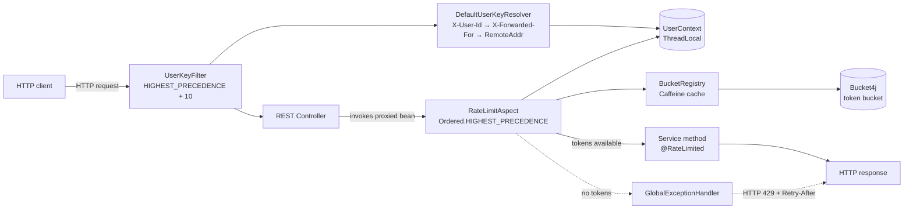
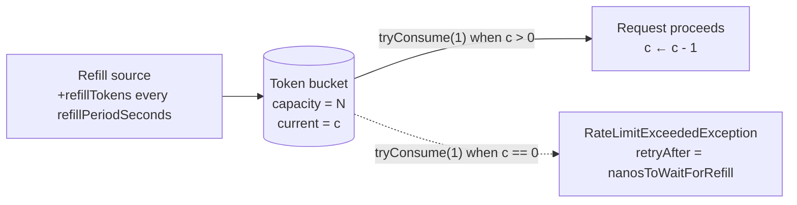
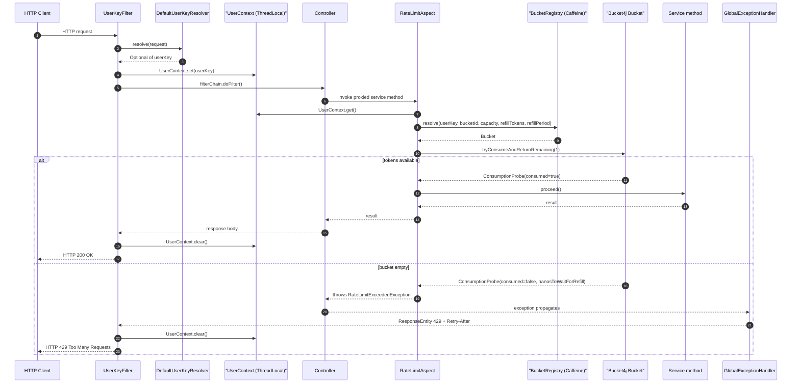
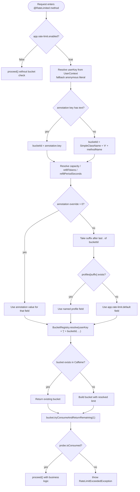
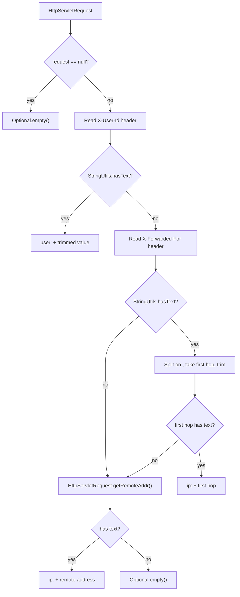
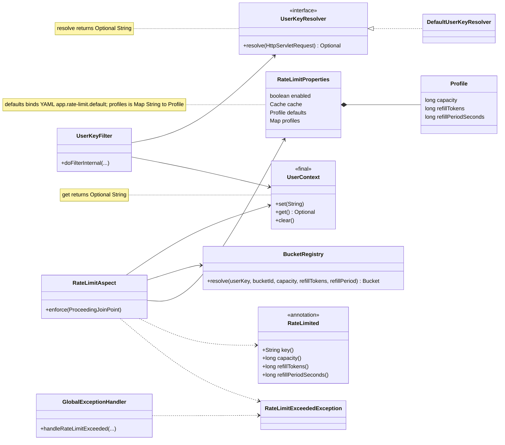
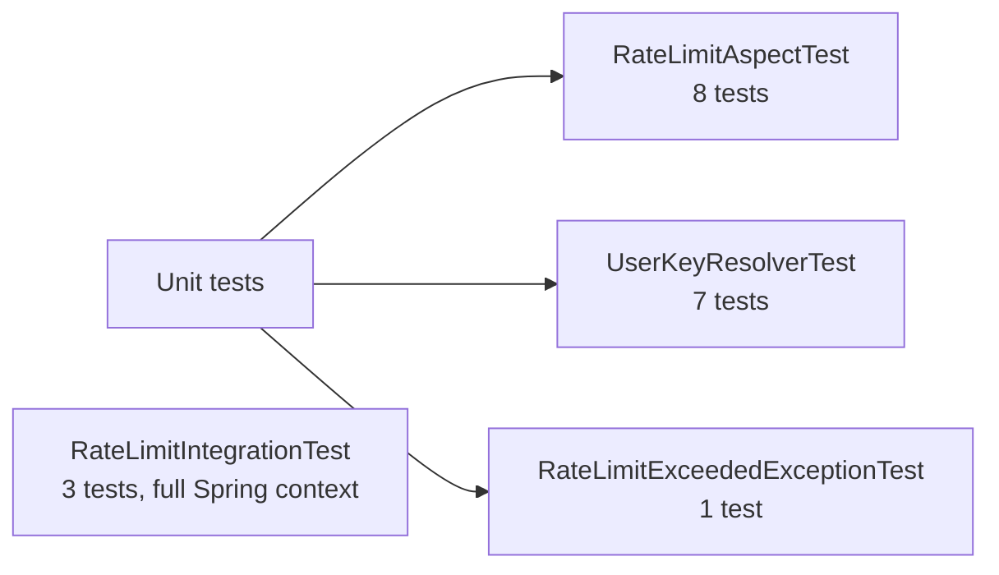

# Rate Limiting Design

This document describes the per-user rate-limiting feature implemented on top
of [Bucket4j](https://github.com/bucket4j/bucket4j). It covers the goals, why
Bucket4j was chosen over alternatives, the runtime architecture, the request
lifecycle, the bucket-resolution algorithm, configuration semantics, the
file-level walkthrough, the 429 response contract, and the testing strategy.

> Source code lives under
> `src/main/java/com/company/customerinfo/ratelimit/` and
> `src/main/java/com/company/customerinfo/exception/RateLimitExceededException.java`.
> Tests live under `src/test/java/com/company/customerinfo/ratelimit/` and
> `src/test/java/com/company/customerinfo/exception/`.

> **GitHub rendering:** Mermaid on GitHub rejects some syntax that still works in other preview tools. This file uses Unicode arrows instead of HTML entities (`&rarr;`), double-quoted node and participant labels when they contain `()`, avoids `Map~String,Profile~`-style generics (**commas inside `~` generics are not supported** in Mermaid), and keeps `sequenceDiagram` participant aliases in quotes when they contain parentheses. When in doubt, check a block at [mermaid.live](https://mermaid.live).

## Table of Contents

1. [Goals and scope](#goals-and-scope)
2. [Why Bucket4j](#why-bucket4j)
3. [High-level architecture](#high-level-architecture)
4. [Token-bucket model](#token-bucket-model)
5. [Request lifecycle](#request-lifecycle)
6. [Bucket and limit resolution](#bucket-and-limit-resolution)
7. [User key resolution](#user-key-resolution)
8. [Configuration reference](#configuration-reference)
9. [Code walkthrough](#code-walkthrough)
10. [HTTP 429 response contract](#http-429-response-contract)
11. [Testing strategy](#testing-strategy)
12. [Operational notes and future work](#operational-notes-and-future-work)

## Goals and scope

The feature has four hard requirements:

1. **Per-user enforcement.** Each caller has its own bucket so heavy users
   cannot starve others.
2. **Service layer, not edge.** Limits must hold even when callers go through
   internal channels (scheduled jobs, asynchronous executors) that bypass
   gateway-level controls. Annotations live on `*Service` methods.
3. **Run before any business logic.** The check must precede transactions,
   caching, circuit breakers, retries, and validation so a rejected call
   never opens a database transaction or evicts a cache entry.
4. **Cheap and predictable in-process** — no external Redis or coordination
   service is required for a single-instance deployment.

Out of scope for this iteration:

- Distributed rate limits across multiple JVMs (the current registry is
  in-memory; Bucket4j supports JCache/Hazelcast/Redis backends if needed
  later).
- Quota persistence across restarts — buckets are re-created on boot.
- Per-tenant or hierarchical limits (one bucket per `(user, method)` pair).

## Why Bucket4j

Bucket4j was selected after comparing it against three realistic alternatives.
The decision criteria, weighted by the goals above, were: support for the
token-bucket algorithm, predictable in-memory performance, JVM ergonomics
(no native dependency), maturity, and an upgrade path to a distributed
backend without rewriting the API.

| Capability                                  | **Bucket4j 8.x** | Resilience4j RateLimiter | Spring Cloud Gateway `RequestRateLimiter` | Guava `RateLimiter` |
|---|---|---|---|---|
| Token-bucket algorithm                      | Yes (native)            | No (fixed window per period)        | Token-bucket via Redis Lua                 | Yes (smooth bursty / warming) |
| Burst capacity decoupled from refill rate   | Yes (`capacity` separate from `refill`) | Limited (`limitForPeriod` only) | Yes                                        | Limited |
| Pluggable backends (in-memory / JCache / Redis / Hazelcast) | Yes  | In-memory only                      | Redis only (out of the box)                | In-memory only |
| Spring Boot integration friction            | Low (POJO library, no auto-config required) | Low (starter)                       | Only inside Gateway routes                | Low |
| Suitable for **service-layer** enforcement  | Yes (no edge dependency) | Yes                                 | No (lives in the Gateway)                 | Yes |
| Probe-style API (`tryConsumeAndReturnRemaining`) returns nanoseconds-to-refill | Yes  | No (returns boolean / blocks)       | No                                         | No |
| Maintained / active                         | Yes                  | Yes                                 | Yes                                        | Frozen (Guava `RateLimiter` is `@Beta`) |

Why Bucket4j wins for this codebase:

- **Token-bucket semantics with a separate burst capacity.** A user can be
  capped at 60 req/min while still allowing a burst of 60 within the first
  second after a cold start — Resilience4j's fixed-window `limitForPeriod`
  cannot express that without ad-hoc workarounds.
- **`tryConsumeAndReturnRemaining(long)` returns a `ConsumptionProbe`** with
  `getNanosToWaitForRefill()`, which maps cleanly onto the HTTP `Retry-After`
  header. Resilience4j and Guava do not expose that information directly.
- **Service-layer fit.** Spring Cloud Gateway's `RequestRateLimiter` only
  runs inside a Gateway route filter chain. The project enforces limits
  inside service methods so they apply to every call site (controllers,
  schedulers, integration tests), which only Bucket4j and Resilience4j
  support cleanly.
- **Future distribution.** When a second instance is added, Bucket4j's
  `ProxyManager` plus a JCache provider (Hazelcast / Redisson) gives a
  distributed bucket without API changes. Guava and Spring Cloud Gateway
  cannot make that move incrementally.
- **Stable, JVM-only library.** No native dependency, no extra process to
  operate during local development, and no `@Beta` warning attached.

Resilience4j's `RateLimiter` is already on the classpath, so a quick note on
why it was not reused: it implements a fixed-window strategy that resets
once per refresh period, which is good for "max N concurrent calls in a
window" but a poor match for the "average X req/min, allow short bursts"
behaviour the project wants. Mixing two rate-limiter implementations on the
same service was rejected as confusing.

## High-level architecture



Key invariants:

- `UserKeyFilter` runs at `Ordered.HIGHEST_PRECEDENCE + 10` so Micrometer’s
  HTTP observation filter opens the trace span first; `UserContext` is then
  populated before controllers (and before Spring Security if it is ever added).
- `RateLimitAspect` runs at `Ordered.HIGHEST_PRECEDENCE` so it is the
  outermost advice on the proxy chain; `@Transactional`, `@Cacheable`,
  `@CircuitBreaker`, `@Retry`, `@TimeLimiter`, and `@Bulkhead` all execute
  *inside* the rate-limit gate and never fire on a rejected call.
- The `BucketRegistry` is in-memory only; rejecting a request never touches
  the database.

## Token-bucket model

Bucket4j implements the classic token-bucket algorithm. Each `(user, bucketId)`
pair owns a bucket with a fixed `capacity` and a refill rule that adds
`refillTokens` every `refillPeriodSeconds`.



Two properties matter:

1. **Burst capacity equals `capacity`.** A fresh bucket starts full, so the
   first `capacity` requests in the same period are allowed back-to-back.
2. **Steady-state throughput equals `refillTokens / refillPeriodSeconds`.**
   Once the bucket has drained, a request is allowed only when the
   intervally-refill clock has produced a token.

The `refillIntervally` strategy is used (not `refillGreedy`) because it
produces deterministic token availability: tokens land in discrete batches
at the end of each refill interval, which is easier to reason about in load
tests and matches `Retry-After` semantics exactly.

## Request lifecycle

The full path of one rate-limited HTTP call:



`UserContext.clear()` runs in a `finally` block inside the filter so that a
thread returned to the request-processing pool never carries another user's
key into the next request.

## Bucket and limit resolution

When the aspect intercepts a `@RateLimited` method it has to answer two
questions:

1. **Which bucket?** Determined by `(userKey, bucketId)`.
2. **What size?** Determined by the resolved `(capacity, refillTokens, refillPeriodSeconds)` triple.



Important subtleties:

- **Limit values are baked into the bucket on first creation.** Changing
  `app.rate-limit.profiles.write.capacity` at runtime will *not* affect
  existing buckets — they keep the size they were built with. Buckets fall
  out of the cache after `expireAfterAccess` idle TTL (see `RateLimitConfig`;
  TTL is derived from configured refill periods, at least 60 seconds) and
  are rebuilt with fresh values on the next access.
- **Per-annotation overrides are field-by-field.** A method can override
  only `capacity` and inherit `refillTokens` / `refillPeriodSeconds` from a
  named or default profile.
- **Empty annotation key** (`@RateLimited` with no `key`) yields a bucket id
  of `<SimpleClassName>#<methodName>`, which means it bypasses the
  named-profile lookup (no `.` in the key) and uses the default profile.
- **`anonymous` is a literal user key**, not a special branch. It shares
  one bucket per `bucketId` across every unauthenticated caller, which is
  intentionally conservative — anonymous traffic is rate-limited as a
  single "user" until an `X-User-Id` header or remote address is supplied.

## User key resolution

`DefaultUserKeyResolver` walks four sources in order:



Notes:

- **Trimming.** The `X-User-Id` value is trimmed so `"  alice  "` and
  `"alice"` collapse to the same key.
- **Forwarded-For first hop.** Only the left-most hop (the originator) is
  used; intermediate proxy addresses are ignored.
- **Anonymous behaviour.** When the resolver returns `Optional.empty()`,
  the filter does not call `UserContext.set(...)`. Inside the aspect the
  fallback `ANONYMOUS_USER_KEY = "anonymous"` is then used as the bucket
  partition.

## Configuration reference

```yaml
app:
  rate-limit:
    enabled: true                       # global kill switch
    cache:
      max-size: 100000                  # max simultaneously-tracked (user,bucket) pairs
    default:                            # used when no override and no named profile match
      capacity: 60
      refill-tokens: 60
      refill-period-seconds: 60
    profiles:                           # selected by the suffix after the last "." of the key
      write:
        capacity: 20
        refill-tokens: 20
        refill-period-seconds: 60
      read:
        capacity: 100
        refill-tokens: 100
        refill-period-seconds: 60
```

| Property                                     | Default | Effect |
|---|---|---|
| `app.rate-limit.enabled`                     | `true`  | When `false` the aspect short-circuits to `joinPoint.proceed()`. |
| `app.rate-limit.cache.max-size`              | `100000` | Caffeine `maximumSize` for the bucket cache; least-recently-accessed entries are evicted. |
| `app.rate-limit.default.capacity`            | `60`    | Bucket size used when the key has no matching named profile and no per-annotation override. |
| `app.rate-limit.default.refill-tokens`       | `60`    | Tokens added per refill interval for the default profile. |
| `app.rate-limit.default.refill-period-seconds` | `60`  | Refill interval (in seconds) for the default profile. |
| `app.rate-limit.profiles.<name>.capacity`    | —       | Bucket size for keys whose suffix equals `<name>`. |
| `app.rate-limit.profiles.<name>.refill-tokens` | —     | Refill tokens for that profile. |
| `app.rate-limit.profiles.<name>.refill-period-seconds` | — | Refill interval for that profile. |

The `BucketRegistry` is configured in `RateLimitConfig` with
`expireAfterAccess(ttl)` where `ttl` is `max(60s, 2 × maxRefillPeriod)` across
the default and named profiles, `maximumSize` from `app.rate-limit.cache.max-size`,
and bounded memory usage.

### Annotated services

| Service | Methods | `key` |
|---|---|---|
| `CustomerService` | `save`, `deleteCustomerById` | `customer.write` |
| `CustomerService` | `findAll`, `findCustomerById` | `customer.read` |
| `CustomerOrderService` | `save`, `deleteCustomerOrderById` | `customerOrder.write` |
| `CustomerOrderService` | `findAll`, `findById` | `customerOrder.read` |
| `OrderItemService` | `save`, `deleteOrderItemById` | `orderItem.write` |
| `OrderItemService` | `findAll`, `findById` | `orderItem.read` |
| `ShippingAddressService` | `findCustomerByShippingAddressID` | `shippingAddress.read` |

The `.write` keys resolve to the `write` profile (20 req/min) and the
`.read` keys resolve to the `read` profile (100 req/min).

## Code walkthrough



### `RateLimited`

A method-only annotation. The four numeric fields default to `-1L` and are
treated as "no override" by the aspect. The `key` field defaults to the
empty string, which forces the `<Class>#<method>` fallback.

### `RateLimitProperties`

Bound under `app.rate-limit`. The Java field for the default profile is
`defaults` (because `default` is reserved), but the getter is
`getDefault()` so Spring Boot relaxed binding maps `app.rate-limit.default`
to it. Named profiles live in a `LinkedHashMap` to preserve declaration
order in logs.

### `UserKeyResolver` / `DefaultUserKeyResolver`

An interface plus a default implementation; declaring the interface keeps
the aspect untouched if a future authenticated resolver replaces the bean.

### `UserKeyFilter`

`OncePerRequestFilter` registered with `Ordered.HIGHEST_PRECEDENCE + 10`
(after Micrometer’s observation filter). The filter's
`try { ... } finally { UserContext.clear(); }` block guarantees no
`ThreadLocal` leak across requests.

### `UserContext`

A small final class wrapping a `ThreadLocal<String>`. Exposes `set`, `get`
(returning an `Optional`), and `clear`.

### `BucketRegistry`

Builds new buckets on cache misses with `Bucket.builder().addLimit(...)`
and the `Bandwidth.builder().capacity(c).refillIntervally(r, period)`
fluent API. Uses `Caffeine` with `maximumSize` and `expireAfterAccess` to
bound memory usage.

### `RateLimitAspect`

`@Aspect` with `@Order(Ordered.HIGHEST_PRECEDENCE)` and an `@Around`
advice on `@annotation(com.company.customerinfo.ratelimit.RateLimited)`.
Two `enforce(...)` methods exist: the public one that Spring AOP calls,
and a package-private overload that takes a pre-resolved annotation so
unit tests can drive the aspect with a `Mockito`-mocked
`ProceedingJoinPoint` without going through reflection. The annotation is
resolved from `MethodSignature.getMethod()`, falling back to a lookup on
the target class to handle CGLIB proxies that strip annotations from the
proxy method.

### `RateLimitConfig`

Wires `UserKeyResolver`, `BucketRegistry`, and registers the
`UserKeyFilter` as a `FilterRegistrationBean` at
`Ordered.HIGHEST_PRECEDENCE + 10` (after Micrometer HTTP observation).
Builds the `BucketRegistry` from the configured `cache.max-size` and TTL
derived from configured refill periods (see `RateLimitConfig`).

### `RateLimitExceededException`

Carries `userKey`, `bucketId`, and `retryAfterNanos`. The `retryAfterNanos`
value comes straight from `ConsumptionProbe.getNanosToWaitForRefill()`.

### `GlobalExceptionHandler.handleRateLimitExceeded`

Converts the exception into a 429 with a `Retry-After` header rounded up to
at least one second, and a JSON body that matches the existing error
envelope (timestamp / status / error / message + `retryAfterSeconds`).

## HTTP 429 response contract

```http
HTTP/1.1 429 Too Many Requests
Retry-After: 12
X-Trace-Id: 6a01a08d44bad222069ae3b5d782f228
Content-Type: application/json

{
  "timestamp": "2026-05-08T12:00:00",
  "status": 429,
  "error": "Too Many Requests",
  "message": "Rate limit exceeded for bucket: customer.write",
  "retryAfterSeconds": 12,
  "traceId": "6a01a08d44bad222069ae3b5d782f228"
}
```

When Micrometer tracing has a current span, `GlobalExceptionHandler` also sets
**`X-Trace-Id`** and the **`traceId`** field (same value) on this payload (see
[doc/tracing.md](tracing.md)).

- `Retry-After` is the **smallest integer number of seconds** that is at
  least `1` and at least the floor of `nanosToWaitForRefill / 1e9`. This is
  a deliberate floor: clients should never see `Retry-After: 0`, which some
  HTTP libraries treat as "retry immediately".
- The body is logged at `WARN` from the handler with the bucket id and
  retry-after, but the user key is **not** included in the JSON body to
  avoid echoing potentially sensitive header values back to the caller.

## Testing strategy



| Class | What it asserts |
|---|---|
| `RateLimitAspectTest` | Token consumption succeeds while tokens remain, throws after exhaustion, isolates buckets between users, short-circuits when `enabled=false`, falls back to `anonymous`, applies per-annotation overrides, resolves named profiles by suffix, derives bucket id from method signature when key is blank. |
| `UserKeyResolverTest` | `null` request, `X-User-Id` precedence and trimming, `X-Forwarded-For` first hop with multiple commas, blank `X-Forwarded-For` falls through to `RemoteAddr`, missing `X-Forwarded-For` falls through to `RemoteAddr`, blank first hop falls through to `RemoteAddr`, all sources missing returns `Optional.empty()`. |
| `RateLimitExceededExceptionTest` | All three accessors and the message contain the expected user key and bucket id. |
| `RateLimitIntegrationTest` | Full Spring context: `capacity + 1` requests yield `429` with a non-zero `Retry-After`, two distinct `X-User-Id` values keep separate buckets, a request with no header is bucketed by `RemoteAddr`, and **`429`** responses include aligned **`traceId`** (JSON) and **`X-Trace-Id`** (header) when tracing is active. |

JaCoCo is configured in the root `pom.xml` (`jacoco-maven-plugin`); run
`mvn clean test` and open `target/site/jacoco/index.html` for current coverage
of `com.company.customerinfo.ratelimit` and related classes.

## Operational notes and future work

### Tuning

- Start with the shipped defaults and watch `Rate limit exceeded` warning
  counts plus 429 rates in Actuator / Prometheus before tightening limits.
- Keep `capacity ≈ refillTokens` for "sustainable steady-state with small
  burst tolerance"; widen `capacity` (e.g. `2 × refillTokens`) when you
  want to forgive short bursts at the price of higher peak load.

### Observability

- The aspect emits a `WARN` log on every rejection with the user key,
  bucket id, and `nanosToWaitForRefill`.
- The handler emits a `WARN` log with the bucket id and the
  rounded-up `retryAfterSeconds` before returning 429.
- Bucket4j 8 also exposes a `Bucket.getAvailableTokens()` accessor that
  could be wrapped in a Micrometer gauge per bucket id; this is left as a
  follow-up.

### Distributed deployment

To enforce shared limits across multiple instances:

1. Replace the in-process `BucketRegistry` with a Bucket4j `ProxyManager`.
2. Pick a backend (`bucket4j-redis`, `bucket4j-hazelcast`, JCache).
3. Keep the same `(userKey, bucketId)` cache-key shape so existing
   annotations and YAML configuration remain valid.

The aspect, filter, properties, and exception handler do not need to
change.

### Known limitations

- Buckets do **not** survive a JVM restart. For most read/write workloads
  this is fine, because limits reset over a `refillPeriodSeconds` window
  anyway, but a deliberately abusive client could time deploys to refresh
  their burst capacity early.
- `app.rate-limit.profiles.*` updates only affect **new** buckets. To pick
  up a tightened limit immediately, restart the JVM or wait until idle
  buckets expire per `expireAfterAccess` TTL in `RateLimitConfig`.
- The current resolver does not understand RFC 7239 `Forwarded:`; it only
  reads `X-Forwarded-For`. Edge networks that strip `X-Forwarded-For`
  should rely on the application sitting behind a proxy that re-emits it,
  or the resolver should be replaced by a custom implementation of
  `UserKeyResolver`.
