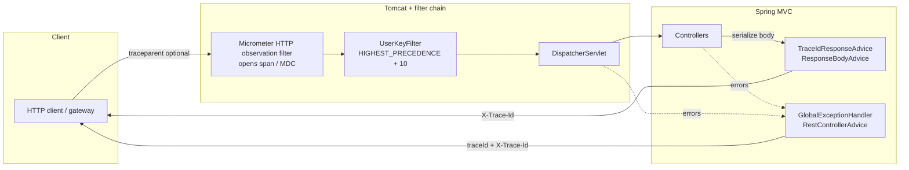

# Distributed tracing implementation

This document describes how HTTP request tracing is implemented in the **customer-info** Spring Boot application: goals, **library selection and rationale**, runtime **design** (components, ordering, and propagation), configuration, the **public HTTP contract**, logging, tests, and operational follow-ups.

---

## 1. Goals and scope

### In scope

- **End-to-end correlation** for a single JVM: tie together log lines, metrics context, and client-visible identifiers for a given HTTP request.
- **Standards-based propagation** so gateways, service meshes, or browsers can continue an existing trace via **W3C Trace Context** (`traceparent` / `tracestate`).
- **Operator- and client-friendly** correlation via a stable **`X-Trace-Id`** header (32-hex trace id) on successful JSON responses and on standardized error responses.
- **Error payloads** that include a **`traceId`** field so support tickets can reference logs without parsing W3C headers.
- **First-class Spring Boot integration**: rely on Micrometer **Observation** for HTTP server spans (no hand-rolled UUID filters as the primary mechanism).

### Explicitly out of scope (default build)

- **No remote trace export** in the default `pom.xml` (no Zipkin reporter, no OTLP exporter). Spans exist in-process for correlation, logging, and optional local debugging; adding a backend is a deliberate dependency and config change.
- **No cross-JVM trace stitching** beyond what clients send in `traceparent` (this app is a single deployable unit in the default architecture).

---

## 2. Library selection and rationale

### 2.1 Micrometer Tracing as the API surface

The application standardizes on **Micrometer Tracing** ([Micrometer Tracing](https://micrometer.io/docs/tracing)), the abstraction Spring Boot Actuator documents for tracing. Benefits:

- **Single façade** (`Tracer`, `Span`, observation integration) regardless of whether the backing implementation is Brave or OpenTelemetry.
- **Tight integration** with Spring Boot **Observation** (HTTP server observations create spans and populate correlation MDC where configured).
- **Alignment with existing metrics**: the project already uses **Micrometer** with a **Prometheus** registry; tracing stays in the same ecosystem.

### 2.2 Brave vs OpenTelemetry (why Brave here)

Spring Boot 4 supports two common combinations (see Spring Boot reference *Tracing*):

| Combination | Typical use |
|-------------|-------------|
| **Brave** + optional Zipkin | Long-standing Spring / Zipkin ecosystem; minimal moving parts for servlet apps. |
| **OpenTelemetry** + OTLP (or legacy Zipkin export) | Org-wide OTel collectors, vendor-neutral pipelines. |

**Brave was chosen for this repository** because:

1. **Spring Boot’s first-class Brave module** — `spring-boot-micrometer-tracing-brave` is the documented, BOM-managed entry point for Brave-backed Micrometer Tracing in Boot 4.
2. **Lower operational surface for a sample / teaching codebase** — no collector sidecar requirement to obtain value from trace ids in logs and HTTP headers.
3. **Stable servlet + MVC integration** — HTTP server observations and Brave’s SLF4J MDC correlation are well-trodden paths for `spring-boot-starter-web`.

**When to prefer OpenTelemetry instead:** if the deployment environment mandates OTLP-only ingestion, unified OTel SDK agents on hosts, or org standards that forbid Brave-specific propagation. Migration would swap the bridge dependency and add `spring-boot-starter-opentelemetry` (or equivalent) plus export configuration—not a redesign of the HTTP contract (`traceId` / `X-Trace-Id`) described below.

### 2.3 Why two Maven coordinates?

The build declares **both**:

```xml
<dependency>
    <groupId>org.springframework.boot</groupId>
    <artifactId>spring-boot-micrometer-tracing-brave</artifactId>
</dependency>
<dependency>
    <groupId>io.micrometer</groupId>
    <artifactId>micrometer-tracing-bridge-brave</artifactId>
</dependency>
```

**Reason:** the published POM for `spring-boot-micrometer-tracing-brave` brings in Spring Boot’s tracing auto-configuration and the Micrometer Tracing API, but **does not** declare the **Brave bridge** implementation on its own in the metadata consumed by Maven for this project. Without **`micrometer-tracing-bridge-brave`**, there is no Brave `Tracing` implementation wired to observations: **`Tracer.currentSpan()` stays empty**, MDC keys `traceId` / `spanId` are not populated, and the feature appears “dead”.

**Rule of thumb:** if you add only the Boot module and see empty correlation brackets in logs, verify the **bridge** artifact is present.

### 2.4 W3C propagation

`application.yml` sets:

```yaml
management:
  tracing:
    propagation:
      consume: W3C
      produce: W3C
```

**Rationale:** W3C Trace Context is the industry default for greenfield HTTP propagation; a single `traceparent` header is easier for API clients than multi-header B3. Brave still supports B3 if you later broaden compatibility for legacy callers.

### 2.5 No exporter in the default POM

Zipkin / OTLP exporters are **intentionally omitted** to:

- Avoid implying a Zipkin or collector endpoint is available in every environment.
- Keep CI and local runs free of failed span uploads or mandatory network.

Adding **`spring-boot-starter-zipkin`** or OTLP export is the natural next step when traces must be stored and queried centrally.

---

## 3. High-level architecture

> **GitHub:** Mermaid here avoids `\n` inside node labels (use `<br/>` instead) and quoted labels where special characters appear, so the file renders in GitHub’s rich Markdown view.



**Flow summary**

1. **Observation filter** (Spring Boot auto-configured, earliest in the chain) creates the **HTTP server observation** and Brave span; correlation fields appear in **MDC** during request processing.
2. **`UserKeyFilter`** runs at **`Ordered.HIGHEST_PRECEDENCE + 10`**, **after** the observation filter so rate limiting and user resolution see the same trace context the rest of the stack uses.
3. **Controllers** return domain objects or `ResponseEntity`; **`TraceIdResponseAdvice`** runs during **message conversion** and adds **`X-Trace-Id`** from **`Tracer.currentSpan()`** while the span is still current.
4. **`GlobalExceptionHandler`** builds JSON error maps and adds **`traceId`** plus **`X-Trace-Id`** when a span exists (validation, domain errors, 429 rate limit, etc.).

---

## 4. Design deep dive

### 4.1 Why `ResponseBodyAdvice` for successful responses?

Several mechanisms were considered for adding **`X-Trace-Id`** to **2xx** JSON responses:

| Approach | Issue observed / trade-off |
|----------|----------------------------|
| **Servlet `Filter` after `FilterChain`** | By the time the outer filter unwinds, the observation scope may already be **closed**; `Tracer.currentSpan()` and MDC can be **empty**, so the header is never set. |
| **`HandlerInterceptor.postHandle`** | Similar lifecycle issue: trace context may be cleared before or after postHandle depending on observation teardown vs. view resolution; also **not invoked** for some error paths handled entirely by `@RestControllerAdvice`. |
| **`ResponseBodyAdvice.beforeBodyWrite`** | Runs **during** `HttpMessageConverter` serialization **after** the controller method returns, while Micrometer still associates the worker thread with the **current span**. `Tracer.currentSpan()` is reliable here for `@RestController` JSON bodies. |

**Chosen design:** `TraceIdResponseAdvice` implements `ResponseBodyAdvice<Object>` with `supports(...) == true` so all JSON (and other) bodies returned through the converter pipeline get a chance to receive **`X-Trace-Id`**, unless the header was already set (e.g. by an upstream filter or test double).

**Caveats**

- **`supports` returns true globally** — Actuator endpoints that go through the same MVC infrastructure may also receive **`X-Trace-Id`**; this is usually harmless. Tighten `supports` to `com.company.customerinfo.controller` if you need stricter scoping.
- **Non-body endpoints** (e.g. raw streaming, special servlet paths that bypass default message converters) might not invoke this advice; errors still get headers from **`GlobalExceptionHandler`** when a span exists.

### 4.2 Why `GlobalExceptionHandler` also sets headers and body fields?

Exception handling runs **outside** the normal “controller return → converter” path for failures that never produce a `@ResponseBody` success path. Centralizing **`traceId`** and **`X-Trace-Id`** in **`GlobalExceptionHandler`** ensures:

- **Bean Validation** (`MethodArgumentNotValidException`) responses are correlated.
- **Domain** errors (`ResourceNotFoundException`, `ServiceUnavailableException`, etc.) are correlated.
- **Rate limiting** (`RateLimitExceededException` → HTTP 429) includes **`traceId`** even when the client never hit a successful controller body path.

Implementation detail: **`Tracer.currentSpan()`** is typically still available inside `@ExceptionHandler` methods for the same request thread.

### 4.3 Interaction with rate limiting (`UserKeyFilter`)

Rate limiting depends on **`UserContext`** populated by **`UserKeyFilter`**. That filter **must not run before** the Micrometer observation filter; otherwise the span might not exist yet and diagnostics would be inconsistent.

**Configuration:** `FilterRegistrationBean` for **`UserKeyFilter`** uses **`Ordered.HIGHEST_PRECEDENCE + 10`**, documented in code and README as **running after** the observation filter (which uses the earliest precedence value).

See: `RateLimitConfig`, `UserKeyFilter` Javadoc.

### 4.4 Logging and MDC

**Logback** (`logback-spring.xml`) embeds **`[%X{traceId:-},%X{spanId:-}]`** in the console pattern so every log line during request processing can be grep’d by trace id.

**Spring Boot property** (from `application.yml`):

```yaml
logging:
  pattern:
    correlation: "[%X{traceId:-},%X{spanId:-}] "
  include-application-name: false
```

This complements the explicit layout: Boot’s correlation pattern is available for tooling or future migration to Spring Boot’s default logging configuration.

**Application name:** `spring.application.name: customer-info` is set for service identification in logs and any future export configuration.

### 4.5 Sampling

| Profile / default | `management.tracing.sampling.probability` |
|-------------------|---------------------------------------------|
| Default (`application.yml`) | `1.0` (every request traced in-process) |
| **`prod`** (second document) | `0.1` (ten percent) to reduce overhead if volume grows |

Adjust per environment; probability sampling affects **which** requests receive new trace roots when the client does not send `traceparent`.

---

## 5. HTTP contract (public behavior)

### 5.1 Incoming headers (client → server)

- **`traceparent`**: W3C Trace Context; when valid, the server continues the trace and the **same trace id** appears in logs and **`X-Trace-Id`**.
- **`tracestate`**: optional vendor-specific state; consumed/produced per W3C when configured.

### 5.2 Outgoing headers (server → client)

- **`X-Trace-Id`**: hex trace identifier (Brave default format), added on successful JSON responses via **`TraceIdResponseAdvice`** when a span exists, and on standardized **`GlobalExceptionHandler`** responses when correlated.

**Note:** `X-Trace-Id` is a **convenience** header, not a W3C standard. Clients that participate in distributed tracing should still prefer emitting **`traceparent`** on outbound calls to downstream services.

### 5.3 Error JSON shape

Standard error maps include, when tracing is active:

- **`traceId`**: string, same value as **`X-Trace-Id`** for that response.

Fields such as **`timestamp`**, **`status`**, **`error`**, and **`message`** remain as before. HTTP **429** from rate limiting additionally includes **`retryAfterSeconds`** and the **`Retry-After`** header.

### 5.4 Constant in code

The header name is centralized in **`TracingHttp.X_TRACE_ID`** to avoid string drift between advice and exception handling.

---

## 6. Configuration reference

### 6.1 Core (`application.yml`)

| Area | Keys / values |
|------|-----------------|
| Application id | `spring.application.name: customer-info` |
| Tracing sampling | `management.tracing.sampling.probability: 1.0` |
| Propagation | `management.tracing.propagation.consume` / `produce`: **W3C** |
| Log correlation | `logging.pattern.correlation`, `logging.include-application-name: false` |

### 6.2 Production profile

`spring.config.activate.on-profile: prod` sets:

```yaml
management:
  tracing:
    sampling:
      probability: 0.1
```

---

## 7. Code map (where to look)

| Component | Responsibility |
|-----------|----------------|
| `pom.xml` | Declares `spring-boot-micrometer-tracing-brave` + `micrometer-tracing-bridge-brave`. |
| `application.yml` | Tracing, propagation, sampling, logging correlation, `spring.application.name`. |
| `logback-spring.xml` | MDC tokens in console pattern. |
| `TracingHttp` | `X-Trace-Id` constant. |
| `TraceIdResponseAdvice` | Adds `X-Trace-Id` during successful response body write. |
| `GlobalExceptionHandler` | Adds `traceId` + `X-Trace-Id` for error responses. |
| `RateLimitConfig` | Registers `UserKeyFilter` at `HIGHEST_PRECEDENCE + 10`. |
| `UserKeyFilter` | Documents ordering relative to tracing. |
| `TracingIntegrationTest` | End-to-end HTTP checks (random port). |
| `TracingSmokeTest` | Three minimal HTTP checks; name avoids `*IntegrationTest` Surefire excludes. |
| `TraceIdResponseAdviceTest` | Unit tests for `TraceIdResponseAdvice` with mocked `Tracer`. |
| `GlobalExceptionHandlerTracingTest` | Unit tests for `GlobalExceptionHandler` trace fields and headers. |

---

## 8. Testing strategy

### 8.1 End-to-end HTTP checks

**`TracingIntegrationTest`** (runs with other `*IntegrationTest` classes):

1. **Successful GET** — asserts **`X-Trace-Id`** is present.
2. **Bean Validation failure** — POST body with invalid age; asserts HTTP **400**, JSON **`traceId`** equals header **`X-Trace-Id`** (case-insensitive).
3. **W3C propagation** — sends a valid **`traceparent`** with a fixed 32-hex trace id; asserts **`X-Trace-Id`** matches (case-insensitive).
4. **Successful POST (201)** — creates a customer with inbound **`traceparent`**; asserts **`X-Trace-Id`** matches the continued trace.
5. **`IllegalArgumentException` (400)** — `PUT /orderitem/update/0` hits `OrderItemService.findById` validation of id; asserts **`traceId`** equals **`X-Trace-Id`**.

**`RateLimitIntegrationTest`** additionally asserts HTTP **429** rate-limit responses include **`traceId`** and **`X-Trace-Id`** aligned.

**`TracingSmokeTest`** repeats only the lightest checks from (1)–(3) above (GET **`X-Trace-Id`**, validation **400** with **`traceId`** + header, inbound **`traceparent`**). Use it when CI excludes `**/*IntegrationTest.java` but you still want a booted HTTP sanity check for tracing.

Tests use **`RestTemplate`** with a no-op `ResponseErrorHandler` so **4xx** responses can be asserted without exceptions.

JaCoCo is bound to the Maven **`test`** phase in **`pom.xml`**; after `mvn clean test`, open **`target/site/jacoco/index.html`** for coverage (full suite unless you filter Surefire).

### 8.2 Unit tests (Mockito)

| Class | What it covers |
|-------|------------------|
| **`TraceIdResponseAdviceTest`** | `supports` returns true; `beforeBodyWrite` adds **`X-Trace-Id`** when `Tracer.currentSpan()` has a non-empty `traceId`; skips when the header is already set, when there is no current span, when `span.context()` is null, or when the trace id is blank. |
| **`GlobalExceptionHandlerTracingTest`** | `GlobalExceptionHandler` with a mocked **`Tracer`**: validation (`MethodArgumentNotValidException`), `IllegalArgumentException`, `ResourceNotFoundException`, `ServiceUnavailableException`, `RateLimitExceededException` (including **`Retry-After`** and **`retryAfterSeconds`**), and the generic `Exception` handler — each with trace present vs. absent (no span / null context) to assert **`traceId`** and **`X-Trace-Id`** behavior. |

These tests do **not** start Spring Boot; they validate branching and response shape in isolation.

---

## 9. Operations and future work

### 9.1 Adding a trace backend

- **Zipkin:** add Spring Boot’s Zipkin support (e.g. `spring-boot-starter-zipkin` per Boot 4 docs), set endpoint URL, verify spans in the Zipkin UI.
- **OTLP:** adopt `spring-boot-starter-opentelemetry` and Micrometer OTel bridge when moving to org-standard collectors.

### 9.2 Sampling and cost

- Lower **`management.tracing.sampling.probability`** in high-traffic environments.
- Keep **W3C** propagation so **externally rooted** traces (sampling decision `01` in flags) still **honor upstream** intent where supported.

### 9.3 Security / privacy

- **`traceId`** is not PII, but **do not** log full security-sensitive payloads solely because a trace id exists.
- Error bodies intentionally **do not echo** raw user keys for rate limiting; the same discipline applies to trace metadata.

---

## 10. Summary

- **Micrometer Tracing + Brave** provide Boot-native HTTP observations, **W3C** propagation, and **MDC-backed** log correlation.
- **`micrometer-tracing-bridge-brave`** is **mandatory** for a functioning Brave implementation alongside the Boot module.
- **`TraceIdResponseAdvice`** adds **`X-Trace-Id`** on success at the right lifecycle point; **`GlobalExceptionHandler`** completes the story for errors and **429**.
- **`UserKeyFilter`** is ordered **after** the observation filter so rate limiting and tracing compose cleanly.
- **No remote exporter** is configured by default; add Zipkin or OTLP when centralized trace storage is required.

For a shorter overview and links, see the **Distributed tracing** section in the project [`README.md`](../README.md).
